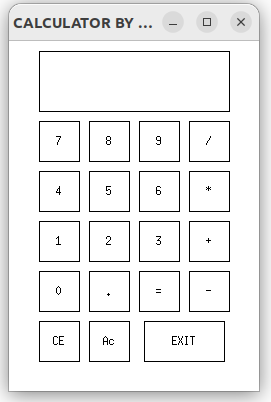

# On-Display-Calculator
## For linux
   [Download for linux](https://www.cse.iitb.ac.in/~ranade/simplecpp/simplecpp.tar)
##### install this and run following commands
###### Now unzip the file using command
    tar -xf simplecpp.tar
###### Go to simplecpp folder using cd command and type command.
    /configure.sh
###### Now compile program using command as "s++ filename.cpp"
## For Windows
   [Download for windows](https://www.cse.iitb.ac.in/~ranade/simplecpp/SimpleCodeBlocks.exe)
##### Download and install this ide to run the program and simply compile and run it

### It looks like this

